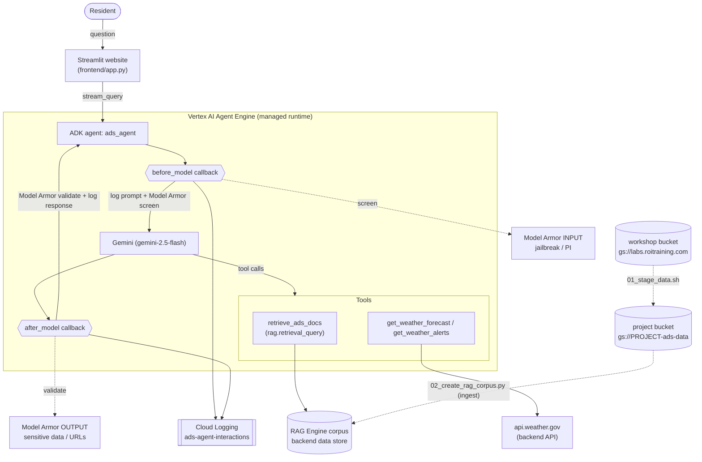

# Architecture — Alaska Department of Snow Online Agent

## Secure request/response flow

1. Resident asks a question on the website.
2. **Log** the prompt to Cloud Logging.
3. **Model Armor (input template)** screens the prompt for prompt-injection /
   jailbreak / harmful content. On a match, the model call is skipped and a safe
   message is returned.
4. Gemini answers, **grounded** in the RAG corpus (`retrieve_ads_docs`) and live
   National Weather Service data (`get_weather_*`).
5. **Model Armor (output template)** validates the response for sensitive-data
   leakage and malicious URLs; violating output is replaced.
6. **Log** the response and return it to the resident.
